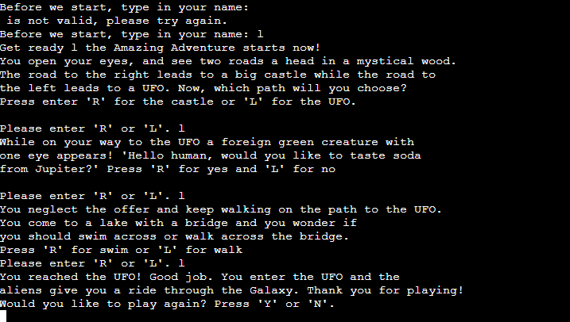
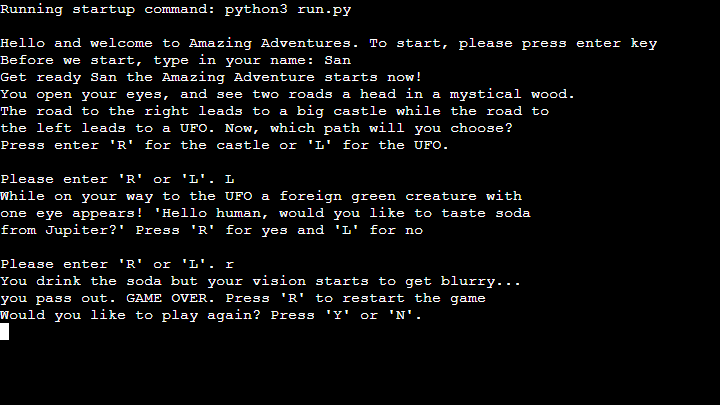

# Amazing Adventures

I present to you, 'Amazing Adventures'! A fun game that has different paths and YOU are the one in charge of the adventure. This game was made with python and it runs in the Code Institute mock terminal on Heroku

## Game Instructions

Amazing Adventures is intended to be fun for every age group so therefore the mechanics are very easy to comprehend!

The instructions pop up on the terminal once the game starts and from there you can just read the scenario and choose your own path.

The game has different adventures and the user has full control over the outcomes. When a scenario is described in the game, the user then gets two choices and can choose from these two with the help of pressing either 'R' or 'L'.

## Features
- Start Game
The game starts with a welcome message and allows the user to enter their desired name. 

## Other Functions 

The user then has a two choices to make and therefor the 'destiny' of the game is in the users hands.

The game has a 'restart' function for when the user either 1. Completes the game or 2. Loses the game (takes the wrong path).

## Validation

If the user doesn't press said key, so for example 'R' or 'L', a error message appears telling the user to do the validation process correct.
This also affects the 'Enter your name' section.

## Testing

The testing procedure was made manually by me, I used the following 
- PEP8 linter and it confirmed that there is no problems
- Tested in my local terminal and also in the Code Institute Heroku terminal

### Bugs

### Remaining bugs
- No bugs remaining that I am aware of

### Validator Testing
As mentioned above, PEP8 was used for the validation. No errors were returned.
## Deployment

Code Institute has provided a [template](https://github.com/Code-Institute-Org/python-essentials-template) to display the terminal view of this backend application in a modern web browser. This is to improve the accessibility of the project to others.

The live deployed application can be found at [https://amazing-adventures-2.herokuapp.com/]().

### Local Deployment

*Gitpod* IDE was used to write the code for this project.

To make a local copy of this repository, you can clone the project by typing the follow into your IDE terminal:
- `git clone https://github.com/SanZangana/Amazing-Adventure-python-.git`

Alternatively, if using Gitpod, you can click below to create your own workspace using this repository.

### Heroku Deployment

This project uses [Heroku](https://www.heroku.com), a platform as a service (PaaS) that enables developers to build, run, and operate applications entirely in the cloud.

Deployment steps are as follows, after account setup:

- Select *New* in the top-right corner of your Heroku Dashboard, and select *Create new app* from the dropdown menu.
- Your app name must be unique, and then choose a region closest to you (EU or USA), and finally, select *Create App*.
- From the new app *Settings*, click *Reveal Config Vars*, and set the value of KEY to `PORT`, and the value to `8000` then select *add*.
- Further down, to support dependencies, select *Add Buildpack*.
- The order of the buildpacks is important, select `Python` first, then `Node.js` second. (if they are not in this order, you can drag them to rearrange them)

Heroku needs two additional files in order to deploy properly.
- requirements.txt
- Procfile

You can install this project's requirements (where applicable) using: `pip3 install -r requirements.txt`. If you have your own packages that have been installed, then the requirements file needs updated using: `pip3 freeze --local > requirements.txt`

The Procfile can be created with the following command: `echo web: node index.js > Procfile`

For Heroku deployment, follow these steps to connect your GitHub repository to the newly created app:

- In the Terminal/CLI, connect to Heroku using this command: `heroku login -i`
- Set the remote for Heroku: `heroku git:remote -a <app_name>` (replace app_name with your app, without the angle-brackets)
- After performing the standard Git `add`, `commit`, and `push` to GitHub, you can now type: `git push heroku main`

The frontend terminal should now be connected and deployed to Heroku.
## Credits
- For this project I would like to thank my CI Mentor Tim Nelson for the tips and feedback on my first python project
- Code Institute for the deployment terminal
- And last but not least the inspiration for Amazing Adventures. [Python Beginner Project](https://www.youtube.com/watch?v=DLn3jOsNRVE&t=4106s&ab_channel=TechWithTim)